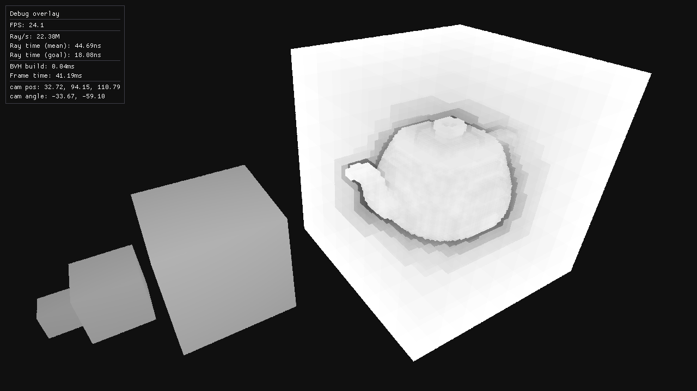
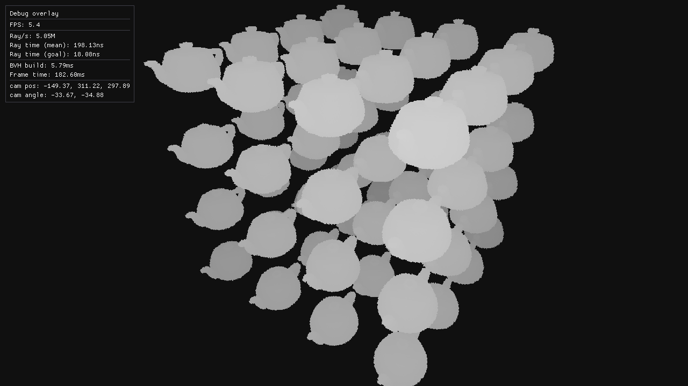

# Software Voxel Ray-tracer
This repo contains a naive implementation of a software voxel ray-tracer.
The purpose of this project is to learn more about SIMD and ray-tracing.

## Render preview
The images below were rendered on a single CPU thread.

